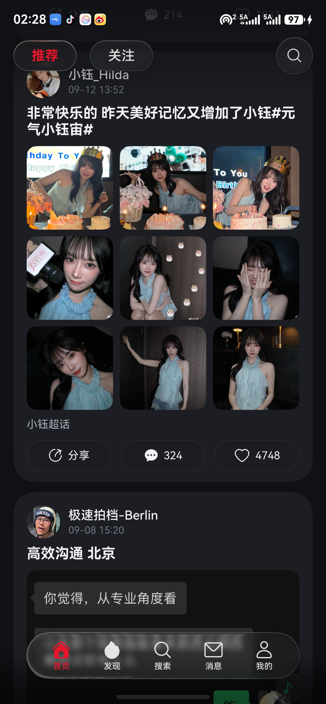
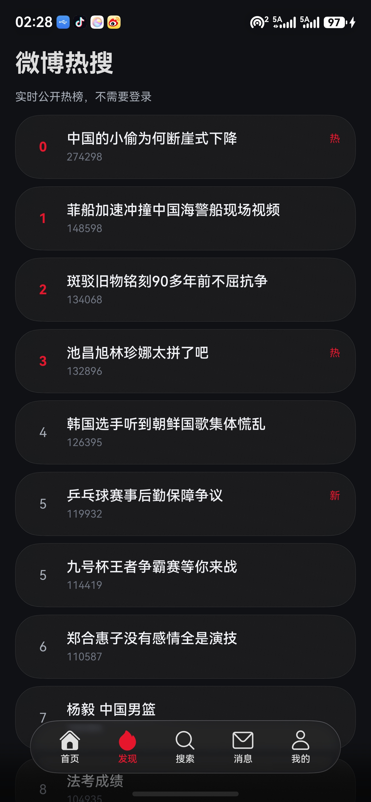
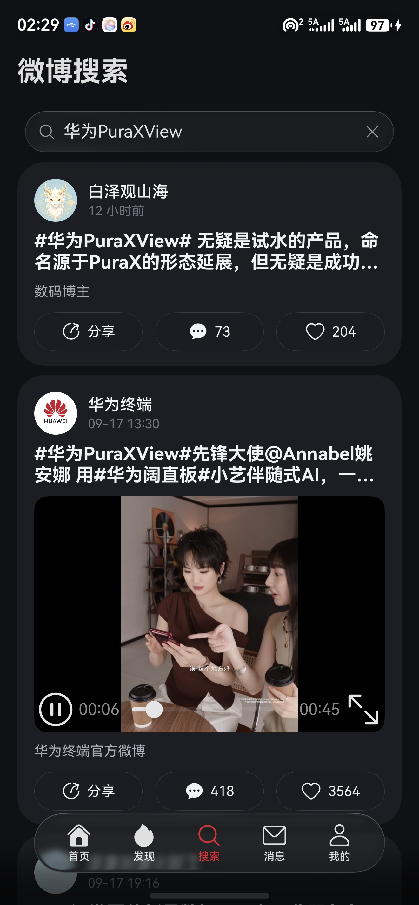
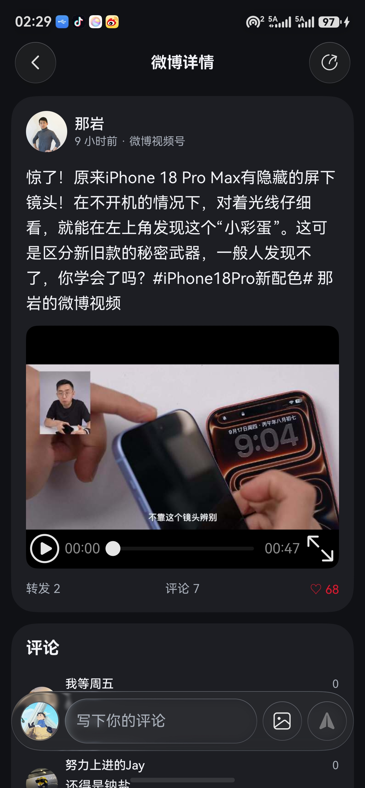
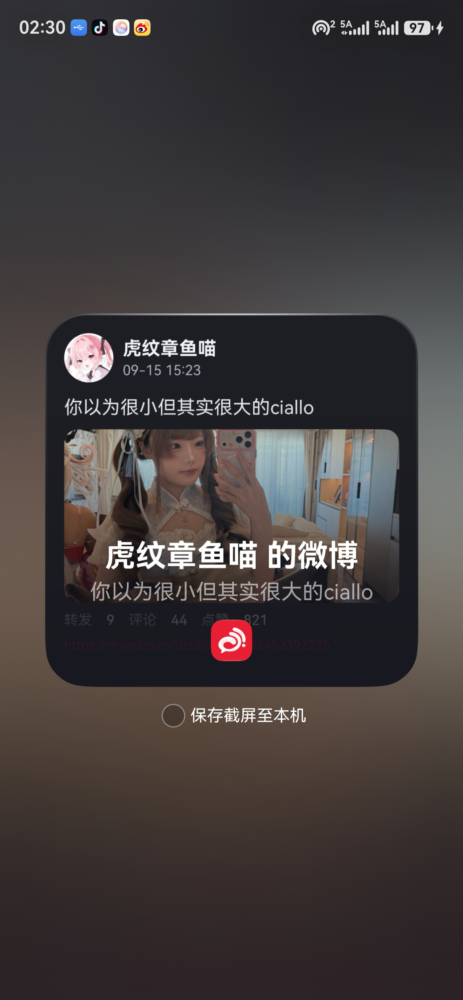

# WeiboPura

> 一款面向 HarmonyOS 的原生 ArkTS / ArkUI 微博浏览客户端原型。

WeiboPura 将微博内容浏览能力接入原生 ArkUI 界面：以卡片化信息流、沉浸式浮动底栏和深色主题呈现推荐、关注、热搜、搜索及帖子详情。工程面向手机和平板，目标平台为 HarmonyOS 7 / API 26。

> 本项目为个人技术验证，与微博及其关联方无关；微博商标、内容、接口和服务规则均归其权利人所有。

## 界面预览

<p align="center">
  
  
  
  
  
</p>

| 界面 | 展示内容 |
| --- | --- |
| 首页 | 推荐 / 关注双入口、图文与视频卡片、瀑布流布局、搜索快捷入口。 |
| 发现 | 无需登录即可读取的公开热搜榜。 |
| 搜索 | 关键词搜索、联想建议和结果流。 |
| 详情 | 原帖、视频播放、评论浏览，以及用户明确触发的点赞和评论。 |
| 分享 | 通过 HarmonyOS 系统分享能力交接内容，不在应用内代发。 |

## 功能一览

- 原生信息流：首页提供“推荐”和“关注”两种时间线；支持继续加载，并以骨架屏反馈加载状态。
- 内容浏览：支持用户主页、原帖详情、评论、图片预览及视频内容展示。
- 热搜与搜索：可读取公开热榜，支持关键词联想与微博内容搜索。
- 账户入口：在内嵌的官方登录页面完成登录后，应用读取该登录态用于需要账户权限的功能。
- 互动由用户掌控：点赞、取消点赞、评论和分享均须由用户在对应界面明确操作；不会后台自动点赞、评论、转发或批量执行操作。
- 系统化体验：支持深浅色主题、沉浸式安全区、圆角玻璃质感底栏、横竖屏与手机 / 平板布局。

## 使用说明

1. 首次启动时阅读数据使用说明并确认；确认前应用不会初始化微博凭据或发起微博请求。
2. 在“首页”浏览推荐动态；“关注”时间线通常需要先完成微博登录。
3. 在“发现”查看实时公开热搜，或在“搜索”输入关键词查找内容。
4. 点开卡片进入详情页，可阅读评论、浏览图片和播放视频。需要点赞或发表评论时，请在详情页自行点击操作。
5. 如需使用关注流或账户相关能力，前往“我的”并打开“登录微博”，在可见的内嵌登录页完成登录；登录态检测成功后返回应用即可使用。

## 数据、隐私与使用边界

WeiboPura 的目标是轻量浏览，而不是自动化运营工具。请在使用前了解以下边界：

- 公开内容在未登录状态下可尝试访问；微博侧可能因风控、验证码、网络或接口变更而限制访问。
- 登录由用户在可见的微博登录页面自行完成。应用仅在检测到有效登录态后，将所需会话信息保存到本机应用存储；除向微博服务发起授权请求外，不会向本项目控制的第三方上传或共享 `SUB`、`XSRF-TOKEN`、App Key 等账号凭据。
- 访客访问使用隔离的内存会话，并采用固定节流；应用不自动登录、不绕过验证码、不规避频率限制。
- 每一次写操作均由当前页面的用户动作触发。应用不提供自动化、定时或批量的点赞、评论、转发功能。
- 微博移动端接口并非本项目可控制的稳定第三方 API，返回字段、访问策略和可用性都可能变化。遇到加载失败时，请稍后重试，并以微博官方客户端的服务规则为准。

实现细节和请求边界见 [docs/weibo-readonly-adapter.md](docs/weibo-readonly-adapter.md)，隐私说明见 [docs/PRIVACY.md](docs/PRIVACY.md)。

## 技术栈

| 项目 | 说明 |
| --- | --- |
| 语言与 UI | ArkTS、ArkUI 声明式 UI |
| 平台 | HarmonyOS；工程 `targetSdkVersion` 为 `26.0.0`，`compatibleSdkVersion` 为 `6.1.0(23)` |
| 构建 | Hvigor / OHPM，通过 DevEco Studio 或 `devecocli` 调用 |
| 设备形态 | `phone`、`tablet`；随窗口宽度切换堆叠或分栏导航 |
| 网络与会话 | 独立微博 HTTP 层、用户本地登录态、内存访客会话与请求节流 |

## 工程结构

```text
.
├── AppScope/                         # 应用元信息、图标与全局资源
├── entry/
│   └── src/main/
│       ├── ets/
│       │   ├── entryability/          # 应用入口能力
│       │   ├── pages/                 # 首页、热搜、搜索、登录、详情和用户主页
│       │   ├── components/            # 公共卡片、骨架屏、访客会话引导等组件
│       │   ├── service/               # 微博服务、登录态、设置与本地状态
│       │   ├── network/               # 微博 HTTP 客户端与响应解析
│       │   ├── model/                 # 稳定的页面数据模型
│       │   ├── common/                # 主题、导航、分享和交互工具
│       │   └── cache/                 # 图片及本地缓存
│       └── resources/                 # 多语言、颜色、媒体和页面路由资源
├── docs/
│   ├── images/                        # README 使用的实机截图
│   └── weibo-readonly-adapter.md      # 微博数据层与边界说明
├── build-profile.json5                # 产品、SDK 和签名构建配置
└── hvigorfile.ts                      # Hvigor 构建入口
```

## 环境要求

- 已安装带 HarmonyOS SDK 的 DevEco Studio；SDK 需覆盖工程配置的兼容 SDK `6.1.0(23)` 和目标 API `26.0.0`。
- Node.js / OHPM / Hvigor 由 DevEco Studio 配套环境提供。
- 连接 HarmonyOS 真机，或准备可用的模拟器；设备需要联网以读取在线内容。

## 构建与运行

### 使用 DevEco Studio

1. 用 DevEco Studio 打开本仓库根目录 `D:\WeiboPura`。
2. 等待 OHPM 依赖同步完成，并确认选择了与工程版本匹配的 HarmonyOS SDK。
3. 在产品配置中选择 `default` 和 `debug`，然后执行 Build；连接设备后运行 `entry` 模块。

### 使用命令行

在仓库根目录执行：

```powershell
# 编译并生成 debug HAP
devecocli build

# 查看已连接的真机或正在运行的模拟器
devecocli device list

# 安装并启动（将 <device-serial> 换成上一步列出的设备标识）
devecocli run --module entry --device <device-serial>
```

如设备上安装过使用不同签名的同包名应用，可在最后一条命令中附加 `--uninstall` 后重新安装。构建产物位于 `entry/build/default/outputs/default/` 下。

## 权限说明

工程声明的权限以 [`entry/src/main/module.json5`](entry/src/main/module.json5) 为准：

| 权限 | 用途 |
| --- | --- |
| `ohos.permission.INTERNET` | 读取微博内容、热搜和搜索结果。 |
| `ohos.permission.VIBRATE` | 为支持的交互提供触感反馈。 |
| `ohos.permission.DETECT_GESTURE` | 支持系统可用时的手势分享交互。 |
| `ohos.permission.KEEP_BACKGROUND_RUNNING` | 支持已声明的后台数据传输场景。 |

## 常见问题

**首页、热搜或搜索加载失败怎么办？**

请先检查网络，再稍后重试。微博侧可能返回限流、验证码或接口变化；本项目不会尝试绕过这些限制。

**为什么“关注”列表为空？**

该列表依赖当前登录账户。请在“我的”中完成微博登录，再返回首页刷新“关注”。

**Cookie 会被上传吗？**

登录态来自用户自行完成的内嵌登录，并保存在本机应用存储中；它只会随发往微博服务的授权请求使用，不会向本项目控制的第三方共享。

**能否自动点赞、评论或转发？**

不能。本项目只响应用户在当前页面明确发起的单次互动。

## 许可证

本工程采用 [GPL-3.0](LICENSE) 许可证。
